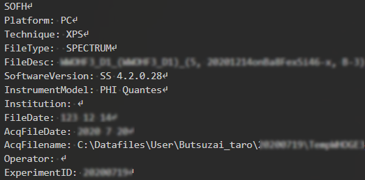
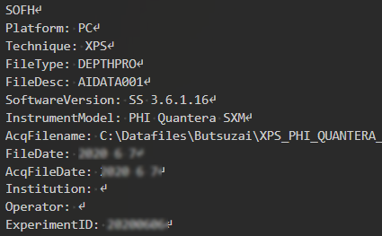
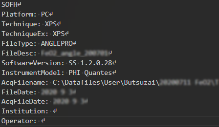
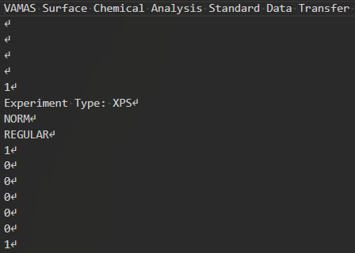
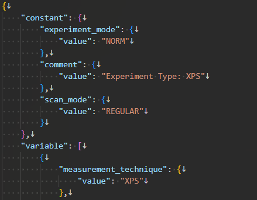
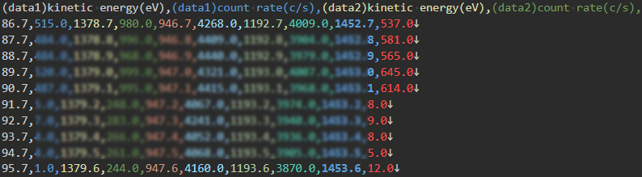
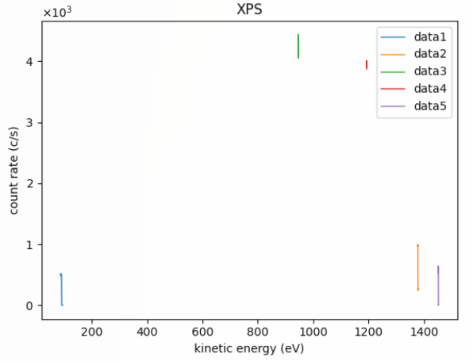
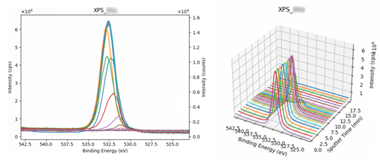

# XPSデータセットテンプレート

## 概要

XPSをご利用の方に適したテンプレートです。以下の入力フォーマットに対応しています。
- ULVAC-PHI社: spe、pro、angフォーマット
- Scienta Omicron社: vms(VAMAS)フォーマット

XPSの専門家によって監修されたメタ情報を計測データファイルから自動的にRDEが抽出します。

## カタログ番号

本テンプレートには、装置メーカーの違いによって以下のバリエーションが提供されています。
- DT0011
    - ULVAC-PHI 社製
- DT0012
    - Scienta Omicron 社製

## 登録データについて

本データセットテンプレートで作成したデータセットには、'計測データファイル'と、その中から抽出した'スペクトルファイル'と'メタ情報'を登録することができます。なお、計測データファイルは１つ登録する必要があります。

### 計測データファイル

以下は本データセットテンプレートに登録可能な計測データファイルの一覧です。

| 種類 | 命名規則 | 説明 |
| :---- | :---- | :---- |
| spe, pro, ang, vmsフォーマット| ※以下の'拡張子以外の命名規則について'参照 | XPS(もしくは付属ソフトウェア)が出力する計測データファイル |

- 計測データファイルのの中身 (以下、例。先頭部のみ)
  - XPS.spe (テキストデータ+バイナリデータ)  
    
  - XPS\.pro (テキストデータ+バイナリデータ)  
    
  - XPS.ang (テキストデータ+バイナリデータ)  
    
  - XPS.vms (テキストデータ)  
    


### スペクトルファイル

スペクトルファイルは、計測データファイルを読み込んで構造化処理を行ったファイルです。スペクトルデータファイルやスペクトル画像ファイルなどが該当します。

| ファイル名 | 内容 |備考|
|:----|:----|:----|
|metadata.json|主要パラメータメタ情報ファイル||
|\*.csv|スペクトルデータファイル|<br>(計測データファイルのフォーマットにより項目が違います。)|
|\*.png|スペクトルグラフ代表画像ファイル|<br>(計測データファイルのフォーマットによりグラフの内容は違います。)|
|\*.png|スペクトルグラフその他画像ファイル|<br>(計測データファイルのフォーマットによりグラフの内容は違います。)|

### メタ情報

次のように、大きく４つに分類されます。

- 基本情報
- 固有情報
- 試料情報
- 抽出メタ情報

#### 基本情報

基本情報はすべてのデータセットテンプレート共通のメタです。詳細は[データセット閲覧 RDE Dataset Viewer > マニュアル](https://dice.nims.go.jp/services/RDE/RDE_manual.pdf)を参照してください。

#### 固有情報

固有情報はデータセットテンプレート特有のメタです。以下は本データセットテンプレートに設定されている固有メタ情報項目です。

|項目名|必須|日本語語彙|英語語彙|単位|初期値|データ型|フォーマット|備考|
|:----|:----|:----|:----|:----|:----|:----|:----|:----|
|flood_gun_emission_current||中和電子銃の電流|Flood Gun Emission Current|uA||number||ULVAC-PHI のみ|
|ion_gun_voltage||中和イオン銃の加速電圧|Ion Gun Voltage|V||number||ULVAC-PHI のみ|
|analysis_field||分析分野|Analysis field|||string||ULVAC-PHI のみ|
|sample_position||試料位置|Sample Position|||string||ULVAC-PHI のみ|
|sample_condition||試料状態|Sample Condition|||string||ULVAC-PHI のみ|
|no3dimage|o|3D画像を作成しない(ang, proの場合のみ有効)|Not Create 3D Image (only for ang or pro)||1|number||ULVAC-PHI のみ|
|key1||キー1|key1|||string||汎用項目|
|key2||キー2|key2|||string||汎用項目|
|key3||キー3|key3|||string||汎用項目|
|key4||キー4|key4|||string||汎用項目|
|key5||キー5|key5|||string||汎用項目|
|common_data_type||登録データタイプ|Data type||XPS|string|||
|common_data_origin||データの起源|Data Origin||experiments|string|||
|common_technical_category||技術カテゴリー|Technical Category||measurement|string|||
|common_reference||参考文献|Reference|||string|||
|measurement_method_category||計測法カテゴリー|Method category||分光法|string|||
|measurement_method_sub_category||計測法サブカテゴリー|Method sub-category||X線光電子分光法|string|||
|measurement_analysis_field||分析分野|Analysis field|||string|||
|measurement_measurement_environment||測定環境|Measurement environment||真空中|string|||
|measurement_energy_level_transition_structure_etc_of_interst||対象準位_遷移_構造|Energy level_transition_structure etc. of interst|||string|||
|measurement_measured_date||分析年月日|Measured date|||string|YYYY-MM-DD|計測データより自動設定(ULVAC-PHI のみ)|
|measurement_standardized_procedure||標準手順|Standardized procedure|||string|||
|measurement_instrumentation_site||装置設置場所|Instrumentation site|||string|||

#### 試料情報

試料情報は試料に関するメタで、試料マスタ（[データセット閲覧 RDE Dataset Viewer > マニュアル](https://dice.nims.go.jp/services/RDE/RDE_manual.pdf)参照）と連携しています。以下は本データセットテンプレートに設定されている試料メタ情報項目です。

|項目名|必須|日本語語彙|英語語彙|単位|初期値|データ型|フォーマット|備考|
|:----|:----|:----|:----|:----|:----|:----|:----|:----|
|sample_name_(local_id)|o|試料名(ローカルID)|Sample name (Local ID)|||string|||
|chemical_formula_etc.||化学式・組成式・分子式など|Chemical formula etc.|||string|||
|administrator_(affiliation)|o|試料管理者(所属)|Administrator (Affiliation)|||string|||
|reference_url||参考URL|Reference URL|||string|||
|related_samples||関連試料|Related samples|||string|||
|tags||タグ|Tags|||string|||
|description||試料の説明|Description |||string|||
|sample.general.general_name||一般名称|General name|||string|||
|sample.general.cas_number||CAS番号|CAS Number|||string|||
|sample.general.crystal_structure||結晶構造|Crystal structure|||string|||
|sample.general.sample_shape||試料形状|Sample shape|||string|||
|sample.general.purchase_date||試料購入日|Purchase date|||string|||
|sample.general.supplier||購入元|Supplier|||string|||
|sample.general.lot_number_or_product_number_etc||ロット番号、製造番号など|Lot number or product number etc|||string|||

#### 抽出メタ

抽出メタ情報は、計測データファイルから構造化処理で抽出したメタデータです。以下は本データセットテンプレートに設定されている抽出メタ情報項目です。

|項目名|日本語語彙|英語語彙|単位|データ型|抽出元（ULVAC-PHI）|抽出元（Scienta Omicron）|備考|
|:----|:----|:----|:----|:----|:----|:----|:----|
| measurement.measured_date | 分析年月日 | Measured date | | string[date]  | AcqFileDate |×| |
| measurement.reference | 参考文献  | Reference | | string||×| |
| measurement.specimen  | 試料| Specimen  | | string||| |
| operator_identifier   | 測定者   | Operator identifier   | | string| Operator|| |
| operator_affiliation_identifier   | 測定者所属機関   | Operator affiliation identifier   | | string||×| |
| institution_identifier | 所属施設など| Institution idendfier | | string| Institution || |
| measurement_technique | 測定手法  | Measurement Technique | | string| Technique   |technique| |
| measurement_instrument| 測定装置  | Measurement Instrument| | string| InstrumentModel |instrument_model_identifier| |
| experiment_id | 測定内容識別ID  | Experiment ID | | string| ExperimentID|experiment_identifier| |
| operation_date_time_year  | 測定日時[年]   | Operation Date-time[Year] | | integer   |×| year_in_full   | |
| operation_date_time_month | 測定日時[月]   | Operation Date-time[Month]| | integer   |×| month  | |
| operation_date_time_day   | 測定日時[日]   | Operation Date-time[Day]  | | integer   |×| day_of_month   | |
| operation_date_time_hour  | 測定日時[時]   | Operation Date-time[Hour] | | integer   |×| hours  | |
| operation_date_time_minute| 測定日時[分]   | Operation Date-time[Minute]   | | integer   |×| minutes| |
| operation_date_time_second| 測定日時[秒]   | Operation Date-time[Second]   | | integer   |×| seconds| |
| experiment_mode   | 実験モード | experiment mode   | | string|×| experiment_mode| |
| file_property | 測定ファイル_属性 | File Property | | string| FileType|×| |
| sputtering_ion_energy | イオンスパッタリングビームエネルギー| Sputtering Ion Energy | kV   | string| SputterEnergy   |×| |
| sputtering_raster_area| スパッタリングラスター範囲 | Sputtering Raster Area| mm   | string| SputterRaster   |×| |
| specimen_stage_rotation_setting_during_sputtering | スパッタ時試料台回転設定  | Specimen Stage Rotation Setting During Sputtering | | string| SampleRotation  |×| |
| depth_profiling_preset_layer_number   | デプスプロファイルスパッタ条件設定レイヤー数| Depth Profiling Preset Layer Number   | | string| NoDepthReg  |×| |
| time_from_sputtering_to_measurement   | スパッタ後測定開始待機時間 | Time from Sputtering to Measurement   | s| string| ProfSputterDelay|×| |
| total_cycle_number| 総サイクル数| Total Cycle Number| | string|DepthCalDef|×| |
| cycle_control_preset  | サイクル制御設定  | Cycle Control Preset  | | string|DepthCalDef|×| |
| software_preset_sputtering_layer_name | ソフトウェア上設定レイヤー名| Software Preset Sputtering Layer Name | | string|DepthCalDef|×| |
| sputtering_layer_preset_interval_time | スパッタレイヤー設定スパッタインターバル時間| Sputtering Layer Preset Interval Time | min  | string|DepthCalDef|×| |
| sputtering_layer_preset_cycle_number  | スパッタレイヤー設定サイクル数   | Sputtering Layer Preset Cycle Number  | | string|DepthCalDef|×| |
| sample_normal_polar_angle_of_tilt | 試料法線極角| sample normal polar angle of tilt | deg  | string||sample_normal_polar_angle_of_tilt| |
| sample_normal_tilt_azimuth| 試料法線方位角   | sample normal tilt azimuth| deg  | string||sample_normal_tilt_azimuth| |
| sample_rotation_angle | 試料回転角 | sample rotation angle | deg  | string||sample_rotation_angle| |
| peak_name | ピーク名  | Peak Name | | string| SpectralRegDef  |　species_label　| |
| transitions   | スペクトルの元素種の遷移  | Transitions   | | string|SpectralRegDef|transition_or_charge_state_label| |
| pass_energy   | パスエネルギー値  | Pass Energy   | eV   | string| SpectralRegDef  |analyser_pass_energy_or<br>_retard_ratio_or_mass_resolution| |
| abscissa_start| 横軸の起点 | Abscissa start| eV   | string| SpectralRegDef  |abscissa_start| |
| abscissa_end  | 横軸の終点 | Abscissa end  | eV   | string| SpectralRegDef  || |
| abscissa_increment| エネルギーステップ幅| Abscissa increment| eV   | string| SpectralRegDef  |abscissa_increment| |
| collection_time   | シグナル収集時間（データ1点当たりの溜め込み時間） | Collection time   | s| string| SpectralRegDef  |signal_collection_time| |
| measurement_acquisition_number_per_peak_sweep | スイープ毎繰返し測定回数  | Measurement Acquisition Number Per Peak Sweep | | string| SurvNumCycles   |number_of_scans_to_compile_this_block| |
| peak_sweep_number | ピークスイープ積算回数   | Peak Sweep Number | | string| SpectralRegDef2 |×| |
| total_acquisition_number  | 総積算回数 | Total Acquisition Number  | | string| SpectralRegDef2 |×| |
| xray_source   | X線源   | Xray Source   | | string| XraySource  |×| |
| scan_mode | スキャンモード   | Scan Mode | | string|×| scan_mode  | |
| sample_identifier | 測定試料識別子   | sample identifier | | string|×| sample_identifier  | |
| number_of_lines_in_block_comment  | ブロックコメント行数| number of lines in block comment  | | string|×| number_of_lines_in_block_comment   | |
| block_comment | ブロックコメント  | block comment | | string|×| block_comment  | |
| xray_power| X線パワー | Xray Power| W| string| XrayPower   |analysis_source_characteristic_energy| |
| analysis_source_label | 分析線源ラベル   | analysis source label | | string||analysis_source_label| |
| analysis_source_characteristics_energy| 分析線源特性エネルギー   | analysis source characteristics energy| eV   | string||analysis_source_characteristic_energy| |
| analysis_source_beam_width_x  | 分析線源ビーム幅x | analysis source beam width x  | um   | string||analysis_source_beam_width_x| |
| analysis_source_beam_width_y  | 分析線源ビーム幅y | analysis source beam width y  | um   | string||analysis_source_beam_width_y| |
| xray_beam_diameter| X線ビーム径| Xray Beam Diameter| um   | string| XrayBeamDiameter|×| |
| analysis_source_polar_angle_of_incidence  | 分析線源入射極角  | analysis source polar angle of incidence  | deg  | string||analysis_source_polar_angle_of_incidence| |
| analysis_source_azimuth   | 分析線源方位角   | analysis source azimuth   | deg  | string||analysis_source_azimuth| |
| analyzer_mode | 分析器分光動作モード| Analyzer Mode | | string| AnalyserMode|analyser_mode| |
| analyzer_work_function| 分析器仕事関数   | Analyzer Work Function| eV   | string| AnalyserWorkFcn |analyser_work_function_or<br>_acceptance_energy_of_atom_or_ion| |
| xray_analyzer_angle   | 照射X線 分析器間角度   | Xray Analyzer Angle   | deg  | string| SourceAnalyserAngle |analyser_axis_take_off_polar_angle| |
| analyzer_solid_angle  | 分析器取込立体角度 | Analyzer Solid Angle  | sr   | string| AnalyserSolidAngle  |analyser_axis_take_off_azimuth| |
| signal_mode   | 信号モード | signal mode   | | string||signal_mode| |
| analysis_region   | 測定領域設定| Analysis Region   | | string| ImageSizeXY |×| |
| analysis_width_x  | X成分   | Analysis Width_x  | um   | string| ImageSizeXY |analysis_width_x| |
| analysis_width_y  | Y成分   | Analysis Width_y  | um   | string| ImageSizeXY |analysis_width_y| |
| values_of_experimental_variables  | 実験変数値 | Values of experimental variables  | | string|×| values_of_experimental_variables   | |
| analysis_source_strength  | 入射プローブの強度 | Analysis source strength  | W| string|×| analysis_source_strength   | |
| target_bias   | 測定試料バイアス電圧| target bias   | V| string|×| target_bias| |
| abscissa_label| 横軸ラベル | abscissa label| | string|×|| |
| corresponding_variables_label | 対応変数ラベル   | corresponding variables label | | string|×|| |
| signal_time_correction| 1掃引あたりの積算時間補正 | signal time correction| s| string|×| signal_time_correction | |
| number_of_ordinate_values | データ点数 | number of ordinate values | | string|×| number_of_ordinate_values  | |
| comment   | コメント  | Comment   | | string| SpectralRegDef2 |comment| |

## データカタログ項目

データカタログの項目です。データカタログはデータセット管理者がデータセットの内容を第三者に説明するためのスペースです。

|RDE用パラメータ名|日本語語彙|英語語彙|データ型|備考|
|:----|:----|:----|:----|:----|
|dataset_title|データセット名|Dataset Title|string||
|abstract|概要|Abstract|string||
|data_creator|作成者|Data Creator|string||
|language|言語|Language|string||
|experimental_apparatus|使用装置|Experimental Apparatus|string||
|data_distribution|データの再配布|Data Distribution|string||
|raw_data_type|データの種類|Raw Data Type|string||
|stored_data|格納データ|Stored Data|string||
|remarks|備考|Remarks|string||
|references|参考論文|References|string||
|key1|キー1|key1|string|送り状メタkey1の説明|
|key2|キー2|key2|string|送り状メタkey2の説明|
|key3|キー3|key3|string|送り状メタkey3の説明|
|key4|キー4|key4|string|送り状メタkey4の説明|
|key5|キー5|key5|string|送り状メタkey5の説明|

## 構造化処理の詳細

### 設定ファイルの説明

構造化処理を行う際の、設定ファイル(`rdeconfig.yaml`)の項目についての説明です。

| 階層 | 項目名 | 語彙 | データ型 | 標準設定値 | 備考 |
|:----|:----|:----|:----|:----|:----|
| system | extended_mode | 動作モード | string | (なし) | 計測データファイル一括投入時'MultiDataTile'を設定。 |
| system | magic_variable | マジックネーム | string | true | 計測データファイル名 = データ名としない場合は'false'に設定。 |
| system | save_thumbnail_image | サムネイル画像保存  | string | true | |
| xps | manufacturer | 装置メーカー名 | string | scienta_omicron or ulvac_phi | 計測データを出力した装置のメーカー名を設定。|
| xps | no3dimage | 3D画像を作成しない | number | 1 or 0 | 1: 3Dグラフを作成しない。 0:  3Dグラフを作成する。<br>(.pro, .angファイルのみ反映可能。<br>rdeconfig.yamlとinvoice両方で設定できる。invoice優先。)|
| xps | axis_inverse_x | X軸反転 | string | false or true |false: X軸反転しない。true: X軸反転する。<br>(.vmsファイルのみ設定可能。rdeconfig.yamlのみ設定可。)|

### dataset関数の説明

XPSが出力するデータを使用した構造化処理を行います。以下関数内で行っている処理の説明です。

```python
def dataset(srcpaths: RdeInputDirPaths, resource_paths: RdeOutputResourcePath) -> None:
    """Execute structured processing in XPS

    Execute structured text processing, metadata extraction, and visualization.
    It handles structured text processing, metadata extraction, and graphing.
    Other processing required for structuring may be implemented as needed.

    Args:
        srcpaths (RdeInputDirPaths): Paths to input resources for processing.
        resource_paths (RdeOutputResourcePath): Paths to output resources for saving results.

    Returns:
        None

    Note:
        The actual function names and processing details may vary depending on the project.
    """
```

### 設定ファイル、メタデータ初期値、使用クラスの取得

- 設定ファイルの設定項目については、[こちら](#設定ファイルの説明) を参照
```python
    # Get config & class to use
    config = XpsFactory.get_config(resource_paths.invoice_org, srcpaths.tasksupport)
    metadata_def, module, suffix = XpsFactory.get_objects(resource_paths.rawfiles[0], srcpaths.tasksupport, config)
```

### 計測データファイル(spe/pro/ang/vmsファイル)読み込み

- 計測データファイルからデータを抽出する。
```python
    # Read input file
    meta, data, data_blocks, data_atoms = module.file_reader.read(resource_paths)
```

### メタデータを抽出し、メタ情報ファイルに保存

- 計測データファイルからメタデータを抽出し、メタ情報ファイル`metadata.json`として保存する。
```python
    # Meta parse & save
    module.meta_parser.parse(meta, data_blocks)
    module.meta_parser.save_meta(resource_paths.meta.joinpath("metadata.json"), Meta(metadata_def))
```

### 計測データファイルのスペクトルデータ保存

- 計測データファイルのデータ部を、スペクトルデータファイル(csv)として保存する。
```python
    # Save csv
    module.structured_processor.save_file(resource_paths, meta, data, data_blocks, data_atoms)
```

### スペクトルデータのグラフ化

- 計測データファイルのフォーマットとデータのブロック数・元素数によって、グラフタイトル、グラフスケール、保存先が変わる。
```python
    # Plot
    module.graph_plotter.plot_main(resource_paths, meta, data, data_blocks, data_atoms, config)

```

### 送り状（invoice.json）の分析年月日を上書き

- 送り状（invoice.json）の分析年月日に何も記入しなかった場合、spe/pro/angファイルのヘッダーから分析年月日を取得し設定する。
```python
    # Overwrite invoice
    if suffix in [".spe", ".pro", ".ang"]:
        module.invoice_writer.overwrite_invoice_measured_date(suffix, resource_paths, meta)
```
